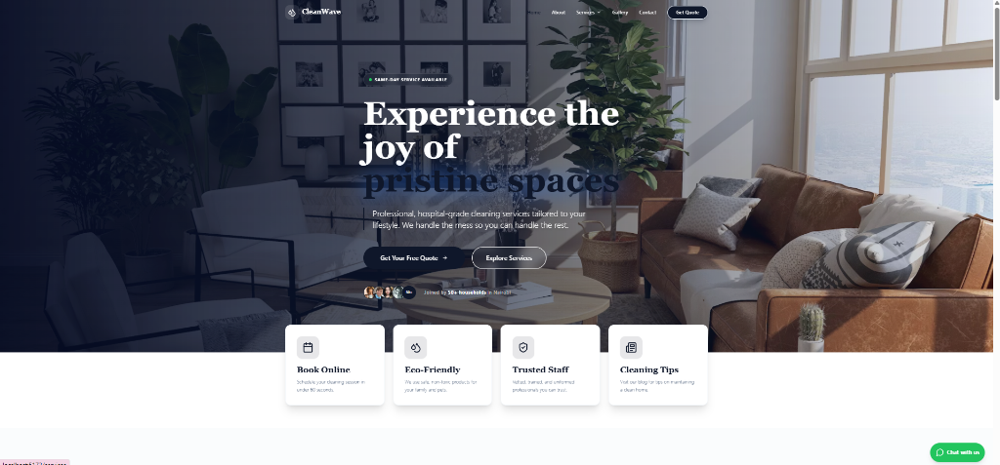

# CleanWave Kenya 🌊✨

[](https://cleanwave-kenya.vercel.app)

## Premium Cleaning Services in Nairobi

CleanWave Kenya provides high-end, hospital-grade cleaning solutions for residential and commercial spaces. Our mission is to transform environments into pristine, healthy sanctuaries using eco-friendly practices and professional expertise.

### 🌟 Key Features

- **Professional Residential Cleaning**: From high-rise apartments to sprawling estates.
- **Office & Commercial Care**: Discrete and thorough maintenance for corporate hubs.
- **Specialized Services**: Laundry, Dry Cleaning, Carpet Steam Cleaning, and more.
- **Eco-Friendly Philosophy**: We use safe, non-toxic products for your family and pets.
- **Trusted Staff**: Fully vetted, trained, and uniformed professionals.

### 🛠 Tech Stack

- **Frontend**: React (Vite)
- **Styling**: Tailwind CSS
- **Animations**: Framer Motion
- **Icons**: Lucide React
- **Forms**: React Hook Form with Zod validation
- **Routing**: React Router

### 🚀 Getting Started

1. **Clone the repository**:
   ```bash
   git clone https://github.com/your-repo/cleanwave-kenya.git
   ```
2. **Install dependencies**:
   ```bash
   npm install
   ```
3. **Run the development server**:
   ```bash
   npm run dev
   ```
4. **Build for production**:
   ```bash
   npm run build
   ```

### 📍 Locations Covered

We currently serve:

- Nairobi
- Mombasa
- Kisumu
- Nakuru
- Eldoret

---

Developed with ❤️ for CleanWave Kenya.
